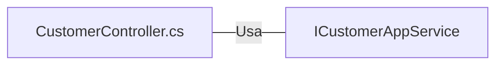

# CustomerController.cs: Controlador de Clientes

## Visão Geral
Este código é responsável por gerenciar as operações de CRUD (Criar, Ler, Atualizar e Deletar) para a entidade Cliente. Ele usa o serviço `ICustomerAppService` para realizar as operações e retorna os resultados como respostas HTTP.

## Fluxo do Processo

```mermaid
graph TD
    Start("Início") --> A["ICustomerAppService (Injeção de Dependência)"]
    A --> B{Método HTTP}
    B -->|GET| C[GetAll()]
    B -->|GET/{id}| D[GetById(id)]
    B -->|POST| E[Register(customerViewModel)]
    B -->|PUT| F[Update(customerViewModel)]
    B -->|DELETE| G[Remove(id)]
    B -->|GET/history/{id}| H[GetAllHistory(id)]
    C --> End("Fim")
    D --> End
    E --> End
    F --> End
    G --> End
    H --> End
```

## Insights
- O controlador `CustomerController` é protegido por autenticação, exigindo que os usuários estejam autenticados para acessar a maioria dos endpoints.
- Alguns endpoints (`GET` e `GET/{id}`) são anotados com `[AllowAnonymous]`, permitindo que usuários não autenticados acessem esses endpoints.
- Os endpoints `POST`, `PUT` e `DELETE` requerem permissões específicas, como definido pela anotação `[CustomAuthorize]`.
- O controlador depende do serviço `ICustomerAppService` para realizar operações de CRUD.

## Dependências (Opcional)
O controlador `CustomerController` tem uma dependência externa:

- `ICustomerAppService`: Este serviço é responsável por realizar operações de CRUD na entidade Cliente.



- `ICustomerAppService` : Este serviço é injetado no controlador e usado para realizar operações de CRUD na entidade Cliente.

## Vulnerabilidades
- Embora a maioria dos endpoints exija autenticação, os endpoints `GET` e `GET/{id}` são acessíveis sem autenticação. Isso pode representar um risco de segurança se os dados do cliente forem sensíveis.
- A validação do modelo é realizada no controlador. Se o modelo não for válido, uma resposta personalizada é retornada. No entanto, a validação do lado do servidor pode não ser suficiente para evitar ataques de injeção de dados maliciosos. A validação do lado do cliente também deve ser implementada para melhorar a segurança.
- As permissões são verificadas no controlador usando a anotação `[CustomAuthorize]`. No entanto, se as permissões não forem configuradas corretamente, os usuários podem ter acesso a ações para as quais não têm permissão.