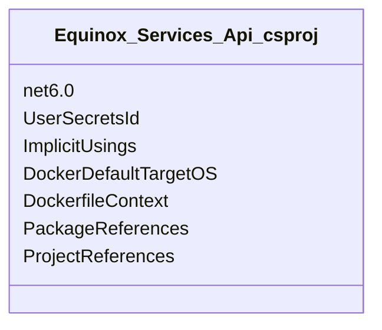
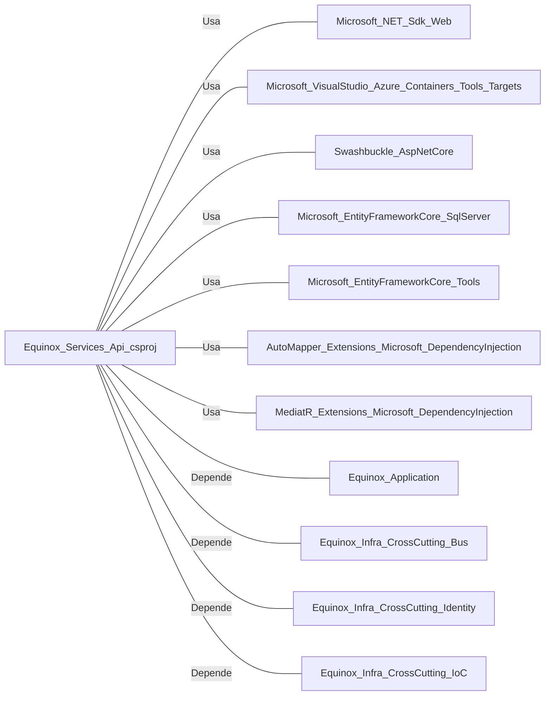

# Equinox.Services.Api.csproj: Configuração do Projeto de Serviço API

## Visão Geral
Este arquivo é uma configuração de projeto para um serviço API .NET 6.0. Ele define as propriedades do projeto, as referências de pacotes e as referências de projetos que são necessárias para a construção e execução do serviço.

## Fluxo do Processo
Como este é um arquivo de configuração de projeto, não há um fluxo de processo específico. No entanto, ele define várias propriedades e dependências que são importantes para a construção e execução do projeto.

## Insights
- O projeto é construído usando o .NET 6.0.
- O projeto usa segredos do usuário, que são identificados pelo ID `b543be42-f7ab-48b6-b633-72d6fb529fb7`.
- O projeto habilita o uso de `ImplicitUsings`, que permite que o compilador determine automaticamente os usings necessários.
- O projeto é configurado para ser executado em um contêiner Docker com o sistema operacional Linux como padrão.
- O projeto inclui várias referências de pacotes, incluindo pacotes para trabalhar com o Entity Framework Core, AutoMapper, MediatR e Swashbuckle.
- O projeto tem referências a outros projetos, incluindo `Equinox.Application`, `Equinox.Infra.CrossCutting.Bus`, `Equinox.Infra.CrossCutting.Identity` e `Equinox.Infra.CrossCutting.IoC`.

## Dependências
O projeto tem várias dependências externas, que são principalmente pacotes NuGet e outros projetos na solução.

- `Microsoft.NET.Sdk.Web`: SDK para a construção de aplicações web com .NET.
- `Microsoft.VisualStudio.Azure.Containers.Tools.Targets`: Ferramentas para trabalhar com contêineres Azure.
- `Swashbuckle.AspNetCore`: Pacotes para a geração de documentação de API Swagger.
- `Microsoft.EntityFrameworkCore.SqlServer`: Pacote para trabalhar com o SQL Server usando o Entity Framework Core.
- `Microsoft.EntityFrameworkCore.Tools`: Ferramentas para trabalhar com o Entity Framework Core.
- `AutoMapper.Extensions.Microsoft.DependencyInjection`: Extensões para integrar o AutoMapper com o sistema de injeção de dependência do .NET.
- `MediatR.Extensions.Microsoft.DependencyInjection`: Extensões para integrar o MediatR com o sistema de injeção de dependência do .NET.
- `Equinox.Application`: Projeto de aplicação na solução.
- `Equinox.Infra.CrossCutting.Bus`: Projeto de infraestrutura para o barramento de mensagens.
- `Equinox.Infra.CrossCutting.Identity`: Projeto de infraestrutura para a gestão de identidade.
- `Equinox.Infra.CrossCutting.IoC`: Projeto de infraestrutura para a injeção de dependência.

## Vulnerabilidades
Como este é um arquivo de configuração de projeto, não há código executável e, portanto, não há vulnerabilidades de código. No entanto, é importante garantir que todas as dependências do projeto estejam atualizadas para as versões mais recentes para evitar possíveis vulnerabilidades de segurança nessas bibliotecas. Além disso, o uso de segredos do usuário deve ser gerenciado com cuidado para evitar a exposição de informações sensíveis.