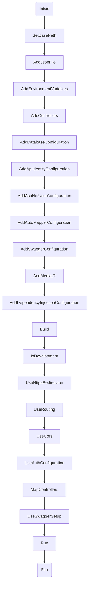
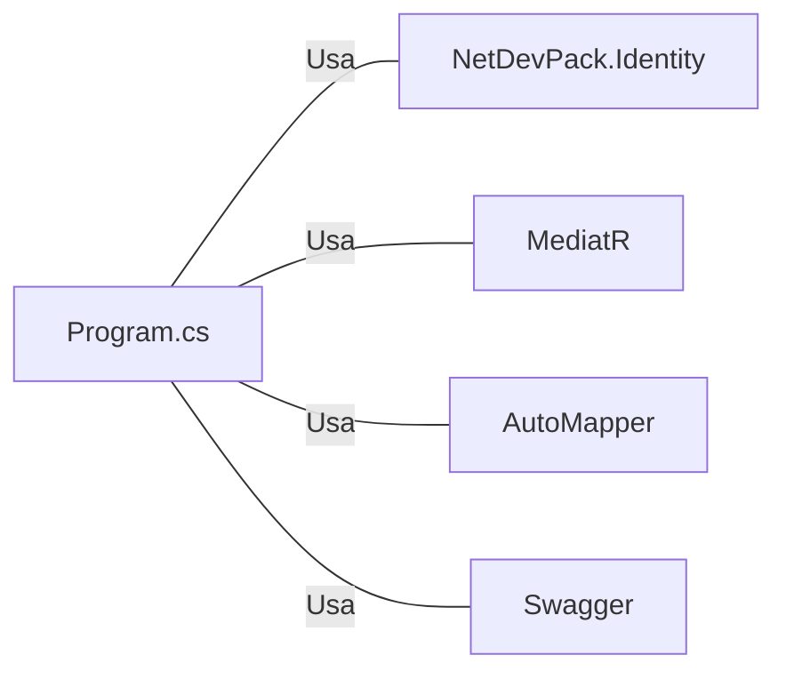

# Program.cs: Configuração e Inicialização do Serviço Web

## Visão Geral
Este código é responsável pela configuração e inicialização de um serviço Web em C#. Ele configura várias dependências, incluindo o ASP.NET Identity, JWT, AutoMapper, Swagger, MediatR e outros. Além disso, ele define as configurações do servidor web, como o uso de HTTPS e CORS.

## Fluxo do Processo

## Insights
- O código utiliza a biblioteca `NetDevPack.Identity` para configuração de autenticação e identidade do usuário.
- O código utiliza a biblioteca `MediatR` para lidar com eventos de domínio e notificações.
- O código utiliza a biblioteca `AutoMapper` para mapeamento de objetos.
- O código utiliza a biblioteca `Swagger` para documentação da API.
- O código configura o CORS para permitir qualquer origem, método e cabeçalho.
- O código utiliza o padrão de injeção de dependência nativo do .NET.

## Dependências (Opcional)
O código tem dependências externas que incluem:

- `NetDevPack.Identity` : Usado para configuração de autenticação e identidade do usuário.
- `MediatR` : Usado para lidar com eventos de domínio e notificações.
- `AutoMapper` : Usado para mapeamento de objetos.
- `Swagger` : Usado para documentação da API.

## Vulnerabilidades
- O código permite qualquer origem, método e cabeçalho no CORS, o que pode ser uma vulnerabilidade de segurança se o serviço for exposto na internet.
- O código não possui tratamento de erros explícito, o que pode levar a falhas silenciosas.