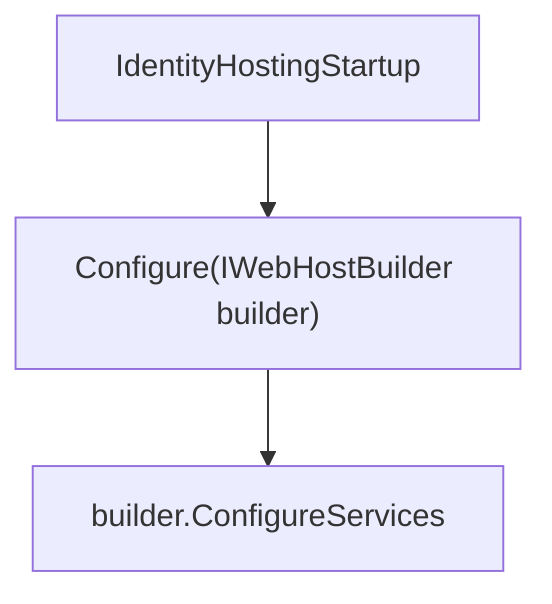
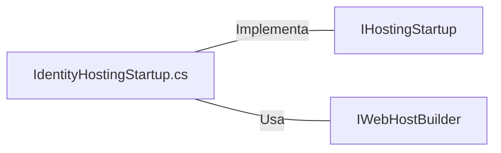

# IdentityHostingStartup.cs: Configuração de Hospedagem de Identidade

## Visão Geral
O arquivo `IdentityHostingStartup.cs` é responsável por configurar os serviços de hospedagem de identidade na aplicação web. Ele faz parte do namespace `Equinox.UI.Web.Areas.Identity` e implementa a interface `IHostingStartup`.

## Fluxo do Processo

Neste diagrama, a classe `IdentityHostingStartup` possui um método `Configure` que recebe um `IWebHostBuilder` como parâmetro. Este método é responsável por configurar os serviços de hospedagem.

## Insights
- A classe `IdentityHostingStartup` implementa a interface `IHostingStartup`, que é uma interface do ASP.NET Core para configurar um servidor web.
- O método `Configure` é chamado pelo tempo de execução do ASP.NET Core para configurar o servidor web.
- O método `ConfigureServices` é usado para adicionar serviços ao contêiner de injeção de dependência.

## Dependências (Opcional)

- `IHostingStartup`: Interface do ASP.NET Core para configurar um servidor web. É implementada pela classe `IdentityHostingStartup`.
- `IWebHostBuilder`: Interface usada para configurar um servidor web. É usada no método `Configure` da classe `IdentityHostingStartup`.

## Vulnerabilidades
Atualmente, não há vulnerabilidades conhecidas no código. No entanto, é importante garantir que todas as configurações de segurança estejam corretas ao configurar o servidor web para evitar possíveis vulnerabilidades de segurança.