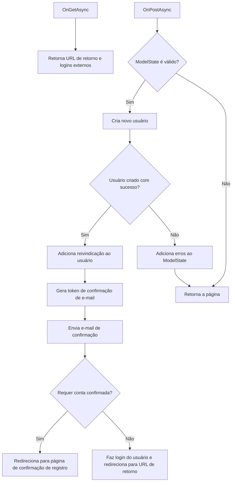

# Register.cshtml.cs: Registro de Usuários

## Visão Geral
Este código é responsável pelo registro de usuários na aplicação. Ele valida as informações de entrada do usuário, cria um novo usuário no sistema, gera um token de confirmação de e-mail e envia um e-mail de confirmação para o usuário. Além disso, ele também lida com o login de usuários externos.

## Fluxo do Processo


## Insights
- O código utiliza o padrão de design de injeção de dependência para obter instâncias de `UserManager`, `SignInManager`, `ILogger` e `IEmailSender`.
- O código faz uso de `IdentityUser` para criar e gerenciar usuários.
- O código adiciona uma reivindicação de "Clientes" com o valor "Escrever" ao usuário após a criação bem-sucedida da conta.
- O código gera um token de confirmação de e-mail e envia um e-mail de confirmação para o usuário.
- O código lida com o login de usuários externos, obtendo esquemas de autenticação externos e armazenando-os em `ExternalLogins`.

## Dependências (Opcional)
```mermaid
graph LR
    Register.cshtml.cs --- |"Usa"| UserManager<IdentityUser>
    Register.cshtml.cs --- |"Usa"| SignInManager<IdentityUser>
    Register.cshtml.cs --- |"Usa"| ILogger<RegisterModel>
    Register.cshtml.cs --- |"Usa"| IEmailSender
```
- `UserManager<IdentityUser>` : Usado para criar um novo usuário e adicionar uma reivindicação ao usuário. Ele também é usado para gerar um token de confirmação de e-mail.
- `SignInManager<IdentityUser>` : Usado para obter esquemas de autenticação externos e fazer login do usuário.
- `ILogger<RegisterModel>` : Usado para registrar informações sobre a criação bem-sucedida de uma nova conta de usuário.
- `IEmailSender` : Usado para enviar um e-mail de confirmação ao usuário.

## Vulnerabilidades
- O código não verifica se o e-mail já está sendo usado por outro usuário antes de tentar criar um novo usuário. Isso pode levar a uma exceção se o e-mail já estiver em uso.
- O código não verifica se o envio do e-mail de confirmação foi bem-sucedido antes de prosseguir para fazer login do usuário ou redirecionar para a página de confirmação de registro. Isso pode levar a uma situação em que o usuário é criado e possivelmente logado, mas não recebe o e-mail de confirmação.
- O código não trata possíveis exceções que podem ocorrer durante a criação do usuário, a adição da reivindicação, a geração do token de confirmação de e-mail ou o envio do e-mail de confirmação. Isso pode levar a uma falha do aplicativo se ocorrer uma exceção.