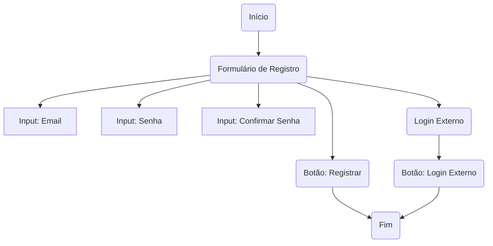

# Register.cshtml: Registro de Usuário

## Visão Geral
Este código é responsável pela criação da página de registro de usuário em uma aplicação ASP.NET. Ele permite que os usuários se registrem fornecendo um endereço de e-mail e uma senha, ou usando um serviço de autenticação externo, se disponível.

## Fluxo do Processo

## Insights
- O código é responsável por renderizar a página de registro de usuário.
- O usuário pode se registrar fornecendo um endereço de e-mail e uma senha.
- O usuário também pode se registrar usando um serviço de autenticação externo, se disponível.
- A validação dos campos de entrada é realizada e os erros são exibidos na interface do usuário.

## Dependências (Opcional)
Não foram identificadas dependências externas neste código.

## Manipulação de Dados (SQL) (Opcional)
Não há manipulação de dados SQL neste código.

## Vulnerabilidades
- O código não parece ter nenhuma proteção contra ataques de injeção SQL, pois não há interação com um banco de dados.
- O código não verifica se o endereço de e-mail fornecido já está registrado, o que pode levar a duplicação de contas.
- Não há nenhuma menção de criptografia de senha, o que pode representar um risco de segurança se as senhas dos usuários forem armazenadas em texto simples.
- O código não limita o número de tentativas de registro, o que pode permitir ataques de força bruta.