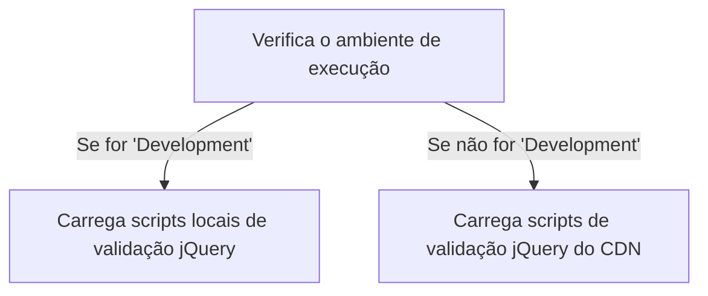
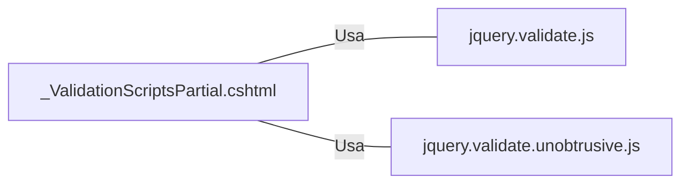

# _ValidationScriptsPartial.cshtml: Scripts de Validação

## Visão Geral
Este arquivo é responsável por carregar os scripts de validação jQuery necessários para a validação do lado do cliente em um aplicativo ASP.NET. Ele verifica o ambiente de execução e carrega os scripts apropriados com base nisso.

## Fluxo do Processo

## Insights
- O arquivo verifica o ambiente de execução e carrega os scripts de validação jQuery apropriados com base nisso.
- Se o ambiente for 'Development', os scripts locais de validação jQuery são carregados.
- Se o ambiente não for 'Development', os scripts de validação jQuery são carregados a partir do CDN da Microsoft, com scripts locais como fallback.

## Dependências
Este arquivo depende dos seguintes scripts externos:

- `jquery.validate.js` : Este script é usado para a validação do lado do cliente. Ele é carregado localmente em ambiente de desenvolvimento e a partir do CDN da Microsoft em outros ambientes.
- `jquery.validate.unobtrusive.js` : Este script é usado para a validação não obstrutiva do lado do cliente. Ele é carregado localmente em ambiente de desenvolvimento e a partir do CDN da Microsoft em outros ambientes.

## Vulnerabilidades
- O código não verifica a integridade dos scripts quando carregados localmente, o que pode levar a problemas de segurança se os scripts locais forem modificados de maneira maliciosa.
- O código confia na disponibilidade do CDN da Microsoft para carregar os scripts em ambientes que não sejam de desenvolvimento. Se o CDN estiver indisponível, a validação do lado do cliente pode falhar.