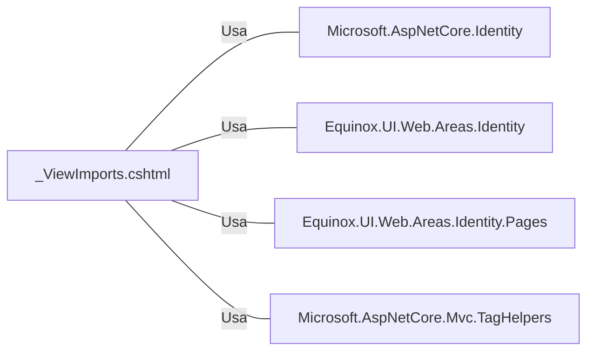

# _ViewImports.cshtml: Importações Globais para Views

## Visão Geral
Este arquivo `_ViewImports.cshtml` é uma estrutura de dados que define importações globais para as views em uma aplicação ASP.NET Core. Ele permite que namespaces sejam importados para todas as views, eliminando a necessidade de importar namespaces individualmente em cada view. Além disso, ele adiciona um Tag Helper globalmente.

## Fluxo do Processo
Como este é um arquivo de estrutura de dados e não contém lógica de programação, um diagrama de classe ou fluxo de processo não seria aplicável. No entanto, os namespaces importados e o Tag Helper adicionado são listados abaixo:

| Namespace/Tag Helper | Descrição |
| --- | --- |
| Microsoft.AspNetCore.Identity | Fornece APIs para gerenciar usuários em termos de criação de identidade, autenticação, autorização e gerenciamento de senha. |
| Equinox.UI.Web.Areas.Identity | Namespace personalizado para a área de identidade na aplicação web Equinox UI. |
| Equinox.UI.Web.Areas.Identity.Pages | Namespace personalizado para as páginas da área de identidade na aplicação web Equinox UI. |
| *, Microsoft.AspNetCore.Mvc.TagHelpers | Adiciona todos os Tag Helpers do namespace Microsoft.AspNetCore.Mvc.TagHelpers globalmente para todas as views. |

## Insights
- Este arquivo facilita a manutenção do código, pois evita a necessidade de importar namespaces individualmente em cada view.
- O uso de Tag Helpers pode melhorar a legibilidade do código HTML e permitir um desenvolvimento mais produtivo.

## Dependências (Opcional)
Este arquivo tem dependências nos seguintes namespaces:
- Microsoft.AspNetCore.Identity
- Equinox.UI.Web.Areas.Identity
- Equinox.UI.Web.Areas.Identity.Pages
- Microsoft.AspNetCore.Mvc.TagHelpers

Diagrama de dependências:

Lista de dependências:
- `Microsoft.AspNetCore.Identity`: Fornece APIs para gerenciar usuários em termos de criação de identidade, autenticação, autorização e gerenciamento de senha.
- `Equinox.UI.Web.Areas.Identity`: Namespace personalizado para a área de identidade na aplicação web Equinox UI.
- `Equinox.UI.Web.Areas.Identity.Pages`: Namespace personalizado para as páginas da área de identidade na aplicação web Equinox UI.
- `Microsoft.AspNetCore.Mvc.TagHelpers`: Adiciona todos os Tag Helpers do namespace Microsoft.AspNetCore.Mvc.TagHelpers globalmente para todas as views.

## Vulnerabilidades
Como este arquivo é apenas uma estrutura de dados que define importações globais e não contém lógica de programação, não há vulnerabilidades de código a serem destacadas. No entanto, é importante garantir que apenas namespaces necessários sejam importados para evitar a exposição de funcionalidades indesejadas ou inseguras. Além disso, o uso de Tag Helpers deve ser feito com cuidado para evitar a injeção de código malicioso.