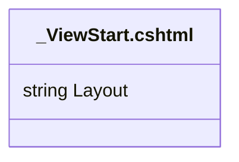

# _ViewStart.cshtml: Configuração do Layout Padrão

## Visão Geral
O arquivo `_ViewStart.cshtml` é responsável por definir o layout padrão para as views na aplicação. Neste caso, o layout padrão é definido como `/Views/Shared/_Layout.cshtml`.

## Fluxo do Processo
Como este é um arquivo de configuração e não contém lógica de programação, um diagrama de fluxo de processo não é aplicável. No entanto, a estrutura do arquivo é simples e direta, consistindo em uma única instrução que define o layout padrão para as views.

## Insights
- O arquivo `_ViewStart.cshtml` define o layout padrão para todas as views na aplicação.
- O layout padrão é definido como `/Views/Shared/_Layout.cshtml`.

## Dependências (Opcional)
Este arquivo não possui dependências externas, pois é um arquivo de configuração que define o layout padrão para as views.

## Manipulação de Dados (SQL) (Opcional)
Este arquivo não realiza nenhuma manipulação de dados SQL, pois é um arquivo de configuração que define o layout padrão para as views.

## Vulnerabilidades
Como este é um arquivo de configuração que não contém lógica de programação, não há vulnerabilidades de código a serem consideradas. No entanto, é importante garantir que o arquivo `_Layout.cshtml` referenciado exista e esteja corretamente configurado, pois qualquer erro neste arquivo afetará todas as views que usam este layout padrão.