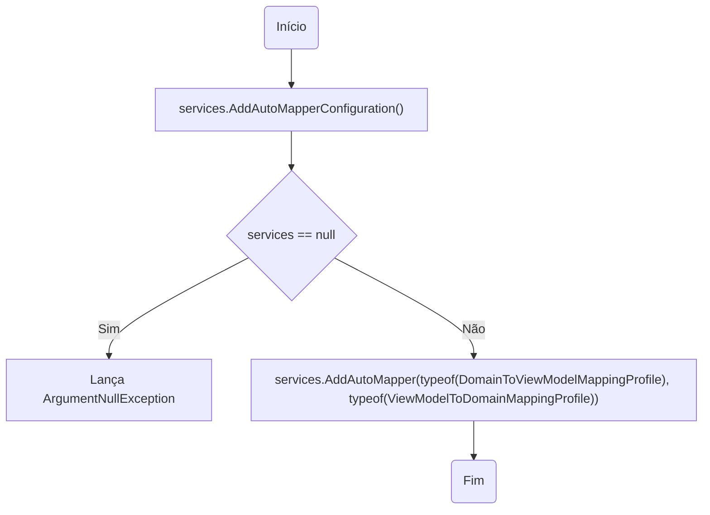
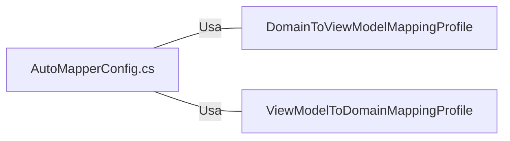

# AutoMapperConfig.cs: Configuração do AutoMapper

## Visão Geral
Este arquivo contém a configuração do AutoMapper para a aplicação. O AutoMapper é uma biblioteca que ajuda a mapear objetos de um tipo para outro. Neste caso, ele está sendo usado para mapear entre os objetos de domínio e os objetos de visualização (ViewModels).

## Fluxo do Processo

## Insights
- A configuração do AutoMapper é adicionada ao `IServiceCollection` através do método de extensão `AddAutoMapperConfiguration()`.
- O método `AddAutoMapperConfiguration()` adiciona o AutoMapper ao `IServiceCollection` e configura os perfis de mapeamento para `DomainToViewModelMappingProfile` e `ViewModelToDomainMappingProfile`.
- Se o `IServiceCollection` passado para o método `AddAutoMapperConfiguration()` for nulo, uma exceção `ArgumentNullException` será lançada.

## Dependências (Opcional)
O arquivo `AutoMapperConfig.cs` tem dependências em relação às seguintes classes:
- `DomainToViewModelMappingProfile`
- `ViewModelToDomainMappingProfile`

- `DomainToViewModelMappingProfile` : Este perfil de mapeamento é usado para mapear objetos de domínio para objetos de visualização (ViewModels).
- `ViewModelToDomainMappingProfile` : Este perfil de mapeamento é usado para mapear objetos de visualização (ViewModels) para objetos de domínio.

## Vulnerabilidades
- O método `AddAutoMapperConfiguration()` lança uma exceção `ArgumentNullException` se o `IServiceCollection` passado for nulo. Isso pode interromper a execução do programa se não for tratado corretamente.