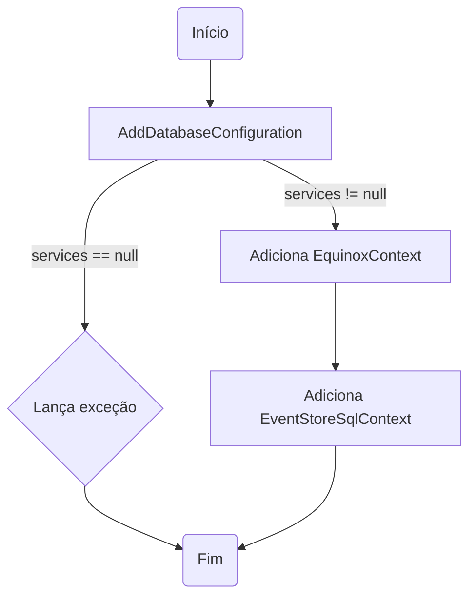
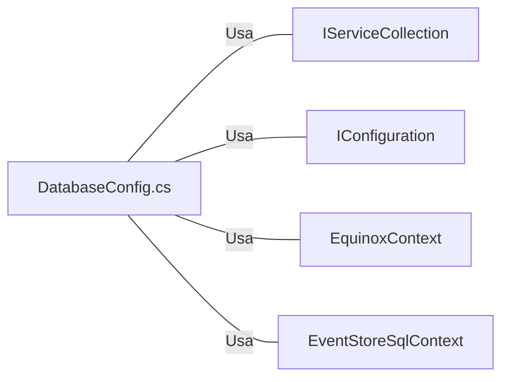

# DatabaseConfig.cs: Configuração do Banco de Dados

## Visão Geral
Este arquivo contém a configuração do banco de dados para a aplicação. Ele define a conexão com o banco de dados para dois contextos diferentes: `EquinoxContext` e `EventStoreSqlContext`.

## Fluxo do Processo

## Insights
- O método `AddDatabaseConfiguration` é uma extensão do `IServiceCollection`. Ele é usado para adicionar a configuração do banco de dados ao serviço.
- O método `AddDatabaseConfiguration` lança uma exceção `ArgumentNullException` se o parâmetro `services` for nulo.
- O método `AddDatabaseConfiguration` adiciona dois contextos de banco de dados: `EquinoxContext` e `EventStoreSqlContext`.
- Ambos os contextos usam a mesma string de conexão, "DefaultConnection", que é obtida da configuração.

## Dependências

- `IServiceCollection`: Usado para adicionar a configuração do banco de dados ao serviço.
- `IConfiguration`: Usado para obter a string de conexão do banco de dados.
- `EquinoxContext`: Um dos contextos de banco de dados adicionados ao serviço.
- `EventStoreSqlContext`: Um dos contextos de banco de dados adicionados ao serviço.

## Vulnerabilidades
- O código não verifica se a string de conexão "DefaultConnection" existe na configuração antes de tentar usá-la. Isso pode levar a uma exceção em tempo de execução se a string de conexão não estiver definida na configuração.
- O código não verifica se a conexão com o banco de dados foi bem-sucedida após a configuração. Isso pode levar a erros em tempo de execução mais tarde, quando o código tentar usar o banco de dados.