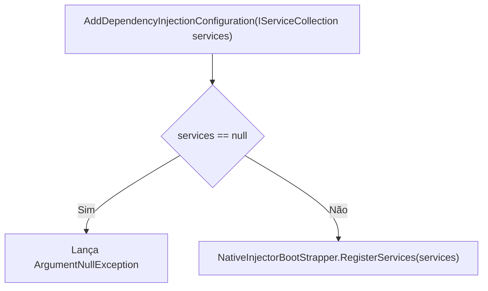

# DependencyInjectionConfig.cs: Configuração de Injeção de Dependência

## Visão Geral
Este arquivo contém a configuração de injeção de dependência para o projeto. Ele define um método de extensão para o `IServiceCollection` que registra os serviços necessários para o projeto.

## Fluxo do Processo

Este diagrama de fluxo mostra o processo de adição da configuração de injeção de dependência. O método `AddDependencyInjectionConfiguration` recebe um objeto `IServiceCollection` como parâmetro. Se o objeto `services` for nulo, uma exceção `ArgumentNullException` é lançada. Caso contrário, o método `RegisterServices` da classe `NativeInjectorBootStrapper` é chamado, passando o objeto `services` como parâmetro.

## Insights
- O arquivo define um método de extensão para o `IServiceCollection` chamado `AddDependencyInjectionConfiguration`.
- Este método registra os serviços necessários para o projeto usando a classe `NativeInjectorBootStrapper`.
- Se o objeto `services` for nulo, uma exceção `ArgumentNullException` é lançada.

## Dependências (Opcional)
Este arquivo tem uma dependência externa na classe `NativeInjectorBootStrapper` do namespace `Equinox.Infra.CrossCutting.IoC`.

- `NativeInjectorBootStrapper` : É chamado no método `AddDependencyInjectionConfiguration` para registrar os serviços necessários para o projeto.

## Vulnerabilidades
- O código não verifica se o objeto `services` é nulo antes de chamar o método `RegisterServices`. Isso pode resultar em uma exceção `ArgumentNullException` se o objeto `services` for nulo. Para evitar isso, é recomendado verificar se o objeto `services` é nulo antes de chamar o método `RegisterServices`.
- O código não verifica se o método `RegisterServices` foi bem-sucedido. Isso pode resultar em um estado inconsistente se o método `RegisterServices` falhar. Para evitar isso, é recomendado verificar o resultado do método `RegisterServices`.