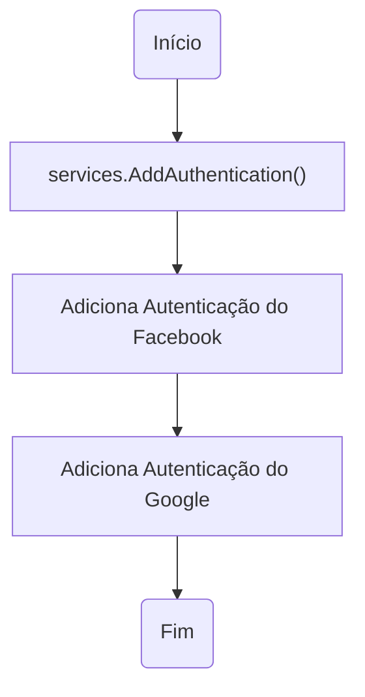
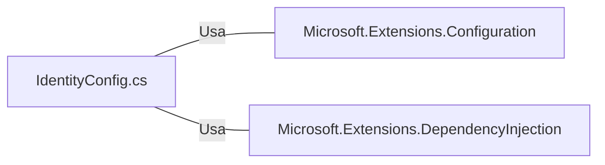

# IdentityConfig.cs: Configuração de Autenticação Social

## Visão Geral
Este arquivo contém uma estrutura de dados que configura a autenticação social para um aplicativo web. Ele define a configuração para autenticação via Facebook e Google, utilizando as credenciais fornecidas na configuração do aplicativo.

## Fluxo do Processo

## Insights
- A autenticação social é configurada para Facebook e Google.
- As credenciais para autenticação são obtidas da configuração do aplicativo.
- A estrutura de dados verifica se o serviço de autenticação é nulo e lança uma exceção se for.

## Dependências (Opcional)
Este código depende das bibliotecas `Microsoft.Extensions.Configuration` e `Microsoft.Extensions.DependencyInjection` para a configuração do aplicativo e a injeção de dependência, respectivamente.

- `Microsoft.Extensions.Configuration` : Usado para acessar as configurações do aplicativo, como as credenciais de autenticação social.
- `Microsoft.Extensions.DependencyInjection` : Usado para adicionar a configuração de autenticação ao serviço de injeção de dependência.

## Vulnerabilidades
- As credenciais de autenticação social são armazenadas na configuração do aplicativo. Se a configuração for comprometida, as credenciais também serão.
- Não há verificação de validade das credenciais fornecidas. Se as credenciais forem inválidas, o processo de autenticação falhará.