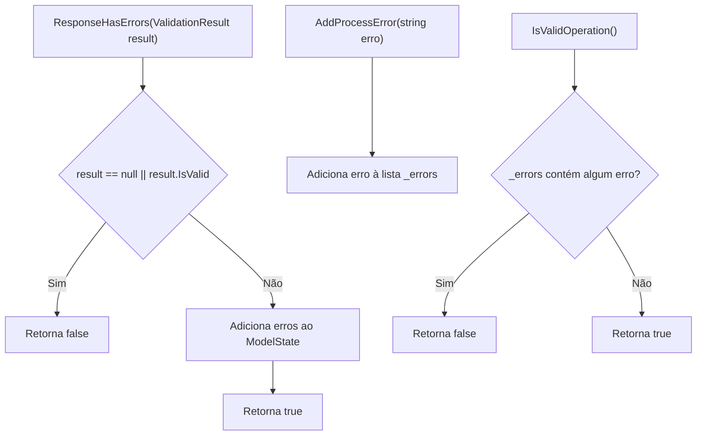
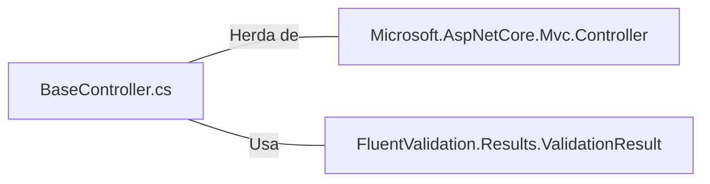

# BaseController.cs: Controlador Base para Validação de Erros

## Visão Geral
O arquivo `BaseController.cs` define uma classe base para controladores na aplicação. Esta classe fornece métodos para manipulação e verificação de erros durante o processamento de requisições.

## Fluxo do Processo

## Insights
- A classe `BaseController` herda de `Controller`, uma classe base do ASP.NET Core MVC.
- A classe `BaseController` mantém uma coleção privada de erros (`_errors`) que pode ser preenchida durante o processamento de uma requisição.
- O método `ResponseHasErrors(ValidationResult result)` verifica se um resultado de validação contém erros. Se houver erros, eles são adicionados ao `ModelState` e o método retorna `true`.
- O método `AddProcessError(string erro)` permite adicionar um erro à coleção `_errors`.
- O método `IsValidOperation()` verifica se existem erros na coleção `_errors`.

## Dependências (Opcional)
- `FluentValidation.Results.ValidationResult`: Utilizado para verificar se um resultado de validação contém erros.
- `Microsoft.AspNetCore.Mvc.Controller`: Classe base de onde `BaseController` herda.

- `Controller`: Classe base do ASP.NET Core MVC que fornece funcionalidades para controladores.
- `ValidationResult`: Classe usada para armazenar o resultado de uma validação.

## Vulnerabilidades
- A coleção de erros `_errors` é privada e só pode ser modificada através do método `AddProcessError`. No entanto, não há um método para limpar a coleção, o que pode levar ao acúmulo de erros se a mesma instância do controlador for usada para processar várias requisições.
- O método `ResponseHasErrors` adiciona erros ao `ModelState`, mas não limpa os erros existentes. Isso pode levar a um estado inconsistente se o método for chamado várias vezes para a mesma requisição.