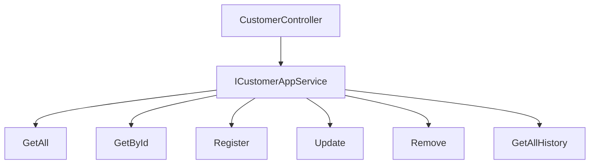
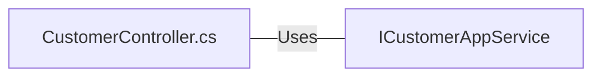

# CustomerController.cs: Controlador de Clientes

## Visão Geral
Este código é um controlador de clientes para uma aplicação web. Ele é responsável por gerenciar as operações CRUD (Criar, Ler, Atualizar e Deletar) para clientes, bem como fornecer um histórico de clientes.

## Fluxo do Processo

## Insights
- O controlador `CustomerController` depende do serviço `ICustomerAppService` para realizar operações de CRUD e obter o histórico do cliente.
- O controlador usa a autorização baseada em reivindicações para proteger suas ações. As ações `Create`, `Edit` e `Delete` requerem a reivindicação "Write" ou "Remove" na reivindicação "Customers".
- As ações `Index`, `Details` e `History` são anônimas e podem ser acessadas sem autenticação.
- As ações `Create`, `Edit` e `Delete` retornam para a mesma visualização em caso de erro, permitindo ao usuário corrigir os erros e tentar novamente.

## Dependências (Opcional)

- `ICustomerAppService` : O controlador `CustomerController` usa o serviço `ICustomerAppService` para realizar operações de CRUD e obter o histórico do cliente.

## Vulnerabilidades
- O controlador `CustomerController` usa a autorização baseada em reivindicações para proteger suas ações. No entanto, as ações `Index`, `Details` e `History` são anônimas e podem ser acessadas sem autenticação. Isso pode ser uma vulnerabilidade se essas ações expuserem dados sensíveis.
- O controlador retorna para a mesma visualização em caso de erro nas ações `Create`, `Edit` e `Delete`. Se a mensagem de erro for detalhada demais, isso pode expor detalhes internos da aplicação que podem ser explorados por um atacante.