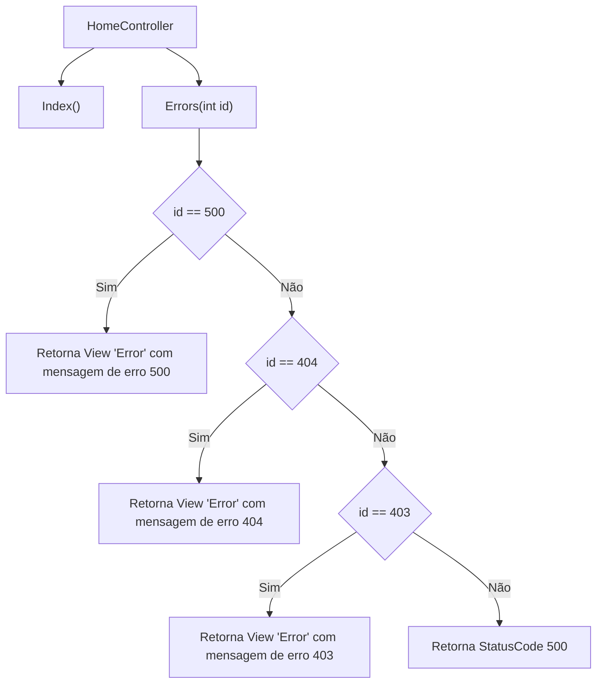

# HomeController.cs: Controlador de Página Inicial e Erros

## Visão Geral
Este código é um controlador em C# para a página inicial e para o tratamento de erros de uma aplicação web. Ele é responsável por renderizar a página inicial e por lidar com erros específicos, retornando mensagens de erro personalizadas para os códigos de erro 500, 404 e 403.

## Fluxo do Processo

## Insights
- O método `Index()` é responsável por renderizar a página inicial.
- O método `Errors(int id)` é responsável por lidar com erros específicos, retornando mensagens de erro personalizadas para os códigos de erro 500, 404 e 403.
- Se o código de erro não for nenhum dos especificados (500, 404, 403), o método `Errors(int id)` retorna o StatusCode 500.

## Dependências (Opcional)
Este código não parece ter dependências externas.

## Manipulação de Dados (SQL) (Opcional)
Este código não realiza manipulação de dados SQL.

## Vulnerabilidades
- O método `Errors(int id)` pode retornar um StatusCode 500 para qualquer código de erro que não seja 500, 404 ou 403. Isso pode ser confuso para o usuário final, pois um erro 500 geralmente indica um erro no servidor, não um erro do cliente.
- As mensagens de erro são codificadas diretamente no método `Errors(int id)`. Isso pode tornar a manutenção dessas mensagens mais difícil, pois qualquer alteração requer uma alteração no código. Uma prática melhor seria armazenar essas mensagens em um arquivo de configuração ou em um banco de dados.
- Não há tratamento de erros para códigos de erro além de 500, 404 e 403. Isso pode levar a experiências de usuário inconsistentes.