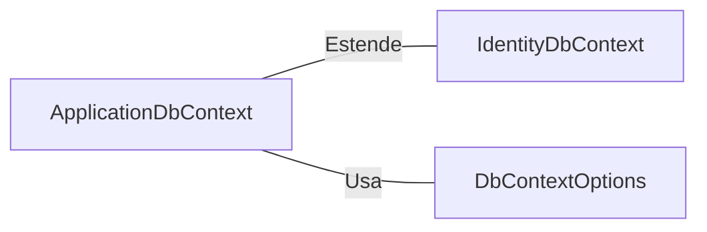

# ApplicationDbContext.cs: Contexto de Banco de Dados de Identidade

## Visão Geral
O arquivo `ApplicationDbContext.cs` define uma classe `ApplicationDbContext` que estende `IdentityDbContext`. Esta classe é usada para interagir com o banco de dados de identidade, que é usado para autenticação e autorização no aplicativo.

## Fluxo do Processo
Como esta é uma estrutura de dados, não há um fluxo de processo específico. No entanto, a estrutura da classe `ApplicationDbContext` pode ser representada como um diagrama de classe:

## Insights
- A classe `ApplicationDbContext` é uma extensão da classe `IdentityDbContext`, que é uma implementação do Entity Framework Core DbContext que inclui tabelas de identidade de usuário.
- O construtor da classe `ApplicationDbContext` aceita um parâmetro do tipo `DbContextOptions<ApplicationDbContext>`, que é usado para configurar o contexto do banco de dados.

## Dependências (Opcional)
A classe `ApplicationDbContext` tem as seguintes dependências externas:

- `IdentityDbContext`: A classe `ApplicationDbContext` estende a classe `IdentityDbContext`, que é uma implementação do Entity Framework Core DbContext que inclui tabelas de identidade de usuário.
- `DbContextOptions`: O construtor da classe `ApplicationDbContext` aceita um parâmetro do tipo `DbContextOptions<ApplicationDbContext>`, que é usado para configurar o contexto do banco de dados.

## Vulnerabilidades
Como a classe `ApplicationDbContext` é uma implementação simples do `IdentityDbContext`, não há vulnerabilidades específicas associadas a ela. No entanto, é importante garantir que as configurações do banco de dados sejam seguras e que o acesso ao banco de dados seja adequadamente protegido para evitar possíveis vulnerabilidades de segurança.