# 00000000000000_CreateIdentitySchema.cs: Criação do Esquema de Identidade

## Visão Geral
Este código é responsável pela criação do esquema de identidade no banco de dados. Ele define as tabelas e colunas necessárias para o gerenciamento de usuários e papéis (roles) no sistema, incluindo autenticação e autorização.

## Fluxo do Processo

```mermaid
graph TD
    Up["Up(MigrationBuilder)"] --> CreateTable_AspNetRoles
    Up --> CreateTable_AspNetUsers
    Up --> CreateTable_AspNetRoleClaims
    Up --> CreateTable_AspNetUserClaims
    Up --> CreateTable_AspNetUserLogins
    Up --> CreateTable_AspNetUserRoles
    Up --> CreateTable_AspNetUserTokens
    Up --> CreateIndexes
    Down["Down(MigrationBuilder)"] --> DropTable_AspNetRoleClaims
    Down --> DropTable_AspNetUserClaims
    Down --> DropTable_AspNetUserLogins
    Down --> DropTable_AspNetUserRoles
    Down --> DropTable_AspNetUserTokens
    Down --> DropTable_AspNetRoles
    Down --> DropTable_AspNetUsers
```

## Insights
- O código cria as tabelas necessárias para o gerenciamento de usuários e papéis (roles) no sistema, incluindo autenticação e autorização.
- As tabelas criadas incluem: AspNetRoles, AspNetUsers, AspNetRoleClaims, AspNetUserClaims, AspNetUserLogins, AspNetUserRoles e AspNetUserTokens.
- Cada tabela tem suas próprias colunas e restrições definidas.
- O código também define índices para algumas colunas para melhorar o desempenho das consultas.
- O método `Down` é responsável por remover todas as tabelas criadas pelo método `Up`.

## Dependências (Opcional)
Não foram identificadas dependências externas neste código.

## Manipulação de Dados (SQL) (Opcional)
O código cria as seguintes tabelas e colunas:

- `AspNetRoles`: 
  - `Id`: string, não nulo
  - `Name`: string, máximo de 256 caracteres, nulo
  - `NormalizedName`: string, máximo de 256 caracteres, nulo
  - `ConcurrencyStamp`: string, nulo

- `AspNetUsers`: 
  - `Id`: string, não nulo
  - `UserName`: string, máximo de 256 caracteres, nulo
  - `NormalizedUserName`: string, máximo de 256 caracteres, nulo
  - `Email`: string, máximo de 256 caracteres, nulo
  - `NormalizedEmail`: string, máximo de 256 caracteres, nulo
  - `EmailConfirmed`: bool, não nulo
  - `PasswordHash`: string, nulo
  - `SecurityStamp`: string, nulo
  - `ConcurrencyStamp`: string, nulo
  - `PhoneNumber`: string, nulo
  - `PhoneNumberConfirmed`: bool, não nulo
  - `TwoFactorEnabled`: bool, não nulo
  - `LockoutEnd`: DateTimeOffset, nulo
  - `LockoutEnabled`: bool, não nulo
  - `AccessFailedCount`: int, não nulo

- `AspNetRoleClaims`: 
  - `Id`: int, não nulo
  - `RoleId`: string, não nulo
  - `ClaimType`: string, nulo
  - `ClaimValue`: string, nulo

- `AspNetUserClaims`: 
  - `Id`: int, não nulo
  - `UserId`: string, não nulo
  - `ClaimType`: string, nulo
  - `ClaimValue`: string, nulo

- `AspNetUserLogins`: 
  - `LoginProvider`: string, máximo de 128 caracteres, não nulo
  - `ProviderKey`: string, máximo de 128 caracteres, não nulo
  - `ProviderDisplayName`: string, nulo
  - `UserId`: string, não nulo

- `AspNetUserRoles`: 
  - `UserId`: string, não nulo
  - `RoleId`: string, não nulo

- `AspNetUserTokens`: 
  - `UserId`: string, não nulo
  - `LoginProvider`: string, máximo de 128 caracteres, não nulo
  - `Name`: string, máximo de 128 caracteres, não nulo
  - `Value`: string, nulo

## Vulnerabilidades
Não foram identificadas vulnerabilidades específicas neste código. No entanto, é importante garantir que as informações sensíveis armazenadas nas tabelas, como hashes de senha, sejam devidamente protegidas e que o acesso ao banco de dados seja restrito para evitar vazamentos de dados.