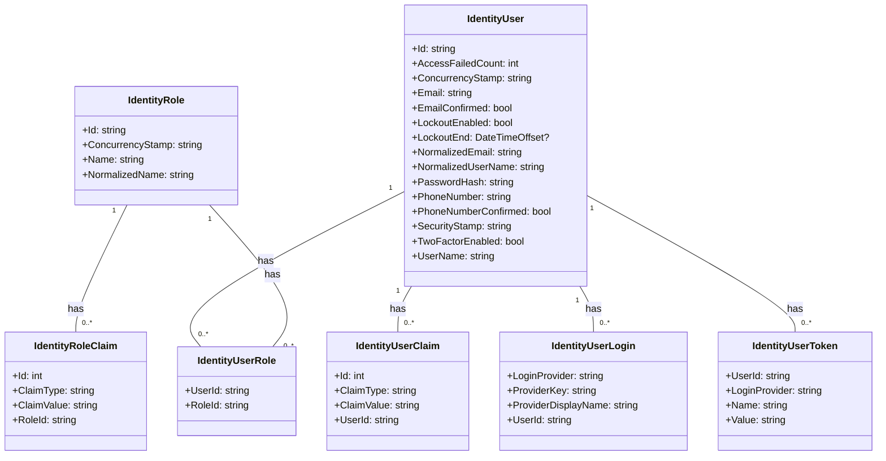

# ApplicationDbContextModelSnapshot.cs: Snapshot do Modelo de Contexto de Aplicação

## Visão Geral
Este arquivo define o snapshot do modelo de contexto de aplicação para o Entity Framework Core. Ele é usado para criar e manter o esquema do banco de dados para a aplicação. O arquivo contém a configuração de várias entidades, incluindo `IdentityRole`, `IdentityRoleClaim`, `IdentityUser`, `IdentityUserClaim`, `IdentityUserLogin`, `IdentityUserRole` e `IdentityUserToken`.

## Fluxo do Processo

## Insights
- O arquivo define a estrutura de várias entidades relacionadas à autenticação e autorização de usuários.
- As entidades são configuradas com várias propriedades, incluindo tipos de dados, restrições de comprimento, chaves primárias e índices.
- As relações entre as entidades também são configuradas, incluindo chaves estrangeiras e comportamento de exclusão.

## Dependências (Opcional)
- Microsoft.EntityFrameworkCore
- Microsoft.EntityFrameworkCore.Infrastructure
- Microsoft.EntityFrameworkCore.Metadata
- Microsoft.EntityFrameworkCore.Storage.ValueConversion
- System

## Manipulação de Dados (SQL) (Opcional)
- As tabelas e suas estruturas são definidas através do código, não há comandos SQL explícitos presentes no código.

## Vulnerabilidades
- O código não parece ter vulnerabilidades óbvias. No entanto, é importante garantir que as versões mais recentes das dependências sejam usadas para evitar vulnerabilidades conhecidas nessas bibliotecas.
- Além disso, é importante garantir que o acesso ao banco de dados seja adequadamente protegido e restrito para evitar a exposição de dados sensíveis.