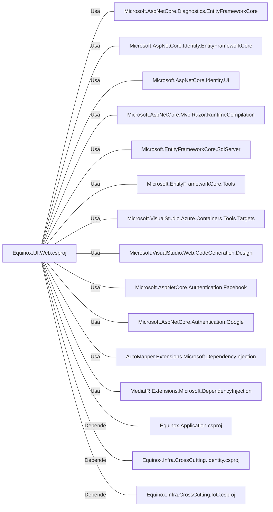

# Equinox.UI.Web.csproj: Configuração do Projeto Web Equinox

## Visão Geral
Este arquivo é uma estrutura de dados que define as configurações do projeto web Equinox. Ele especifica o framework de destino, as configurações de segredos do usuário, as configurações do Docker e as referências de pacotes e projetos necessários para o projeto.

## Fluxo de Processo
Como este arquivo é uma estrutura de dados e não contém lógica de programação, um diagrama de classe ou tabela seria mais apropriado para representar suas informações. Abaixo está uma tabela que lista as principais propriedades definidas no arquivo.

| Propriedade | Descrição |
|-------------|-----------|
| TargetFramework | Define o framework de destino como .NET 6.0 |
| UserSecretsId | Define o ID dos segredos do usuário para o projeto |
| ImplicitUsings | Habilita o uso implícito de namespaces |
| DockerDefaultTargetOS | Define o sistema operacional padrão do Docker como Linux |
| DockerfileContext | Define o contexto do Dockerfile |
| PackageReference | Define as referências de pacotes necessários para o projeto |
| ProjectReference | Define as referências de projetos necessários para o projeto |

## Insights
- O projeto está configurado para usar o .NET 6.0.
- O projeto faz uso de segredos do usuário, que são armazenados com um ID específico.
- O projeto está configurado para rodar em um ambiente Docker com o sistema operacional Linux.
- O projeto depende de vários pacotes, incluindo pacotes para Entity Framework, autenticação, mapeamento de objetos e injeção de dependência.
- O projeto também depende de outros projetos dentro da mesma solução, especificamente `Equinox.Application`, `Equinox.Infra.CrossCutting.Identity` e `Equinox.Infra.CrossCutting.IoC`.

## Dependências (Opcional)
O arquivo de projeto tem várias dependências externas na forma de pacotes e projetos. Abaixo está um diagrama que mostra essas dependências.

## Vulnerabilidades
Como este arquivo é uma estrutura de dados e não contém lógica de programação, não há vulnerabilidades de código a serem destacadas. No entanto, é importante notar que a segurança do projeto depende da segurança dos pacotes e projetos dos quais depende. Portanto, é crucial manter todas as dependências atualizadas para as versões mais recentes e seguras.