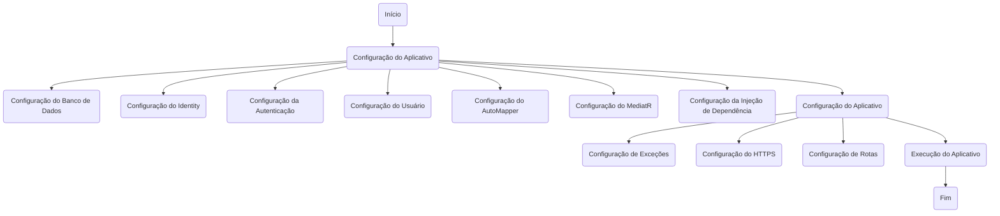
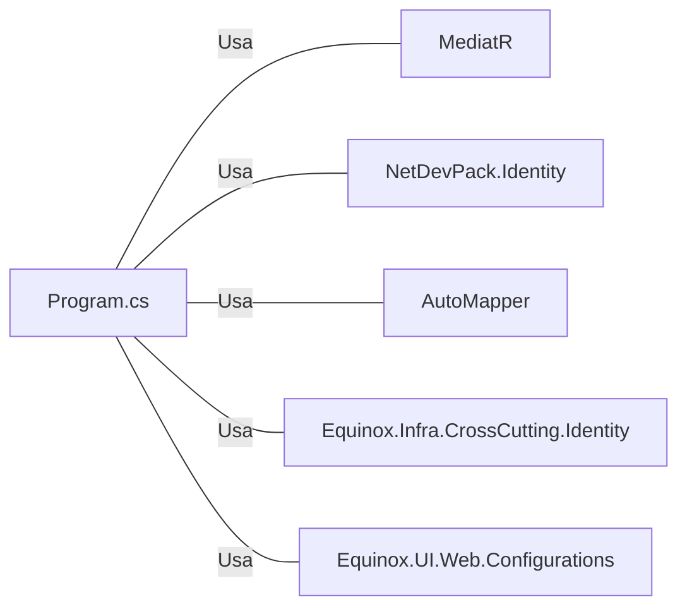

# Program.cs: Configuração e Inicialização do Aplicativo Web

## Visão Geral
Este código é responsável pela configuração e inicialização de um aplicativo web ASP.NET. Ele define as configurações do aplicativo, incluindo a configuração do banco de dados, autenticação e autorização, mapeamento de rotas e manipulação de exceções.

## Fluxo do Processo

## Insights
- O código utiliza a biblioteca `MediatR` para lidar com eventos de domínio e notificações.
- O código utiliza a biblioteca `NetDevPack.Identity` para configuração de autenticação e autorização.
- O código utiliza a biblioteca `AutoMapper` para mapeamento de objetos.
- O código utiliza a biblioteca `Equinox.Infra.CrossCutting.Identity` para configuração do Identity.
- O código utiliza a biblioteca `Equinox.UI.Web.Configurations` para configuração do banco de dados e outras configurações do aplicativo.

## Dependências (Opcional)

- `MediatR` : Utilizado para lidar com eventos de domínio e notificações.
- `NetDevPack.Identity` : Utilizado para configuração de autenticação e autorização.
- `AutoMapper` : Utilizado para mapeamento de objetos.
- `Equinox.Infra.CrossCutting.Identity` : Utilizado para configuração do Identity.
- `Equinox.UI.Web.Configurations` : Utilizado para configuração do banco de dados e outras configurações do aplicativo.

## Vulnerabilidades
- O código não possui validação de entrada de dados, o que pode levar a ataques de injeção.
- O código não possui tratamento de erros adequado, o que pode levar a falhas silenciosas.
- O código não possui logs adequados, o que pode dificultar a detecção e resolução de problemas.
- O código não possui testes unitários, o que pode levar a falhas não detectadas.