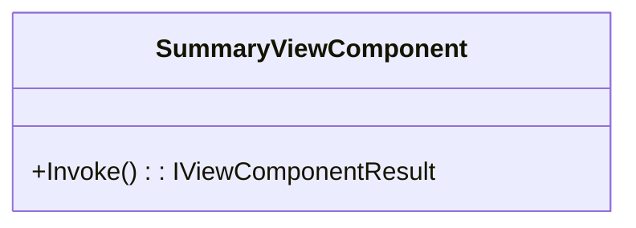

# SummaryViewComponent.cs: Componente de Visualização de Resumo

## Visão Geral
O arquivo `SummaryViewComponent.cs` define uma estrutura de dados que representa um componente de visualização em uma aplicação web. Este componente é responsável por retornar uma visualização padrão quando invocado.

## Fluxo do Processo
Como este código é uma estrutura de dados e não contém lógica de programação, um diagrama de classe é mais apropriado para representar suas características.

## Insights
- A classe `SummaryViewComponent` herda de `ViewComponent`, uma classe base para componentes de visualização em aplicações ASP.NET Core.
- A função `Invoke` é o ponto de entrada para o componente de visualização. Quando invocado, ele retorna uma visualização chamada "Default".

## Dependências (Opcional)
Este código não possui dependências externas.

## Manipulação de Dados (SQL) (Opcional)
Este código não realiza nenhuma operação de manipulação de dados SQL.

## Vulnerabilidades
Não foram identificadas vulnerabilidades específicas neste código. No entanto, é importante notar que a segurança de um componente de visualização depende em grande parte de como ele é usado e dos dados que ele processa. Portanto, recomenda-se seguir as melhores práticas de segurança ao usar componentes de visualização em uma aplicação ASP.NET Core.