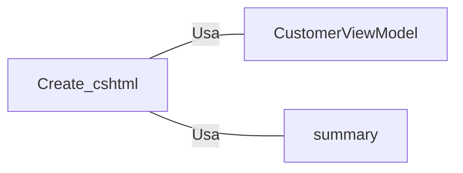

# Create.cshtml: Registro de Novo Cliente

## Visão Geral
Este código é responsável por criar a interface de usuário para o registro de um novo cliente. Ele é uma estrutura de dados que define a forma como os dados do cliente são coletados e validados.

## Fluxo do Processo
Como este código é uma estrutura de dados e não contém lógica de programação, um diagrama de classe ou tabela seria mais apropriado para representar seus componentes. No entanto, como o código é bastante autoexplicativo e não contém atributos complexos, um diagrama ou tabela não seria particularmente informativo ou útil.

## Insights
- O código define um formulário para coletar e validar os dados do cliente.
- O formulário inclui campos para o nome, e-mail e data de nascimento do cliente.
- O código usa a tag helper `asp-for` para vincular os campos do formulário aos atributos do modelo de visualização do cliente.
- O código usa a tag helper `asp-validation-for` para exibir mensagens de erro de validação para cada campo.
- O código inclui um botão de envio para enviar o formulário e um link para voltar à lista de clientes.

## Dependências (Opcional)
Este código depende do modelo de visualização do cliente (`CustomerViewModel`) para definir a estrutura dos dados do cliente. Ele também depende do componente de visualização `summary` para exibir um resumo das mensagens de erro de validação.

- `CustomerViewModel` : Modelo de visualização usado para definir a estrutura dos dados do cliente. Ele é usado para vincular os campos do formulário aos atributos do cliente.
- `summary` : Componente de visualização usado para exibir um resumo das mensagens de erro de validação. Ele é usado para substituir o resumo de validação clássico.

## Vulnerabilidades
Este código não apresenta vulnerabilidades óbvias. No entanto, é importante notar que a segurança e a validação adequada dos dados do cliente são essenciais para evitar problemas de segurança. Isso inclui a validação do lado do servidor dos dados do formulário para proteger contra ataques de injeção de SQL e a proteção contra ataques de falsificação de solicitação entre sites (CSRF) ao enviar o formulário.