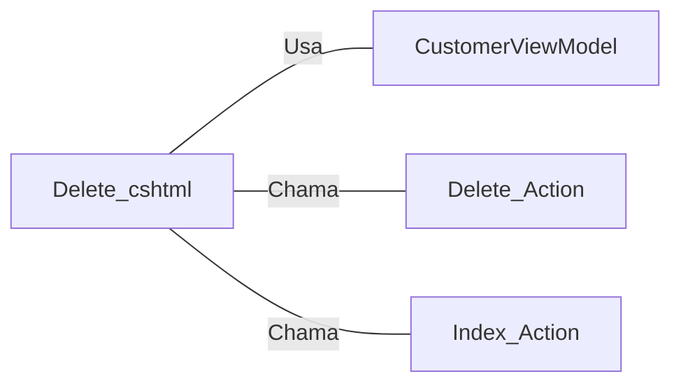

# Delete.cshtml: Deletar Cliente

## Visão Geral
Este código é uma estrutura de dados que representa a interface de usuário para deletar um cliente em uma aplicação web. Ele exibe os detalhes do cliente e solicita a confirmação do usuário antes de prosseguir com a ação de exclusão.

## Fluxo do Processo
Como este é uma estrutura de dados, não há um fluxo de processo lógico. No entanto, a estrutura dos dados pode ser representada da seguinte maneira:

| Atributo | Tipo | Descrição |
|----------|------|-----------|
| Name | String | Nome do cliente |
| Email | String | Email do cliente |
| BirthDate | DateTime | Data de nascimento do cliente |

## Insights
- A estrutura de dados é usada para representar um cliente com atributos de Nome, Email e Data de Nascimento.
- A interface de usuário solicita a confirmação do usuário antes de prosseguir com a ação de exclusão.
- A interface de usuário fornece um link para voltar à lista de clientes.

## Dependências (Opcional)
Este código depende do `CustomerViewModel` para obter os detalhes do cliente a ser excluído. Além disso, ele faz referência a ações de controlador específicas, como `Delete` e `Index`.

- `CustomerViewModel` : Fornece os detalhes do cliente a ser excluído. É usado para preencher os campos na interface do usuário.
- `Delete_Action` : Ação do controlador que é chamada quando o usuário confirma a exclusão do cliente.
- `Index_Action` : Ação do controlador que é chamada quando o usuário clica no link "Voltar para a lista".

## Vulnerabilidades
Não foram identificadas vulnerabilidades específicas neste código. No entanto, é importante garantir que a ação de exclusão seja protegida contra solicitações não autenticadas ou não autorizadas para evitar a exclusão acidental ou maliciosa de dados do cliente.