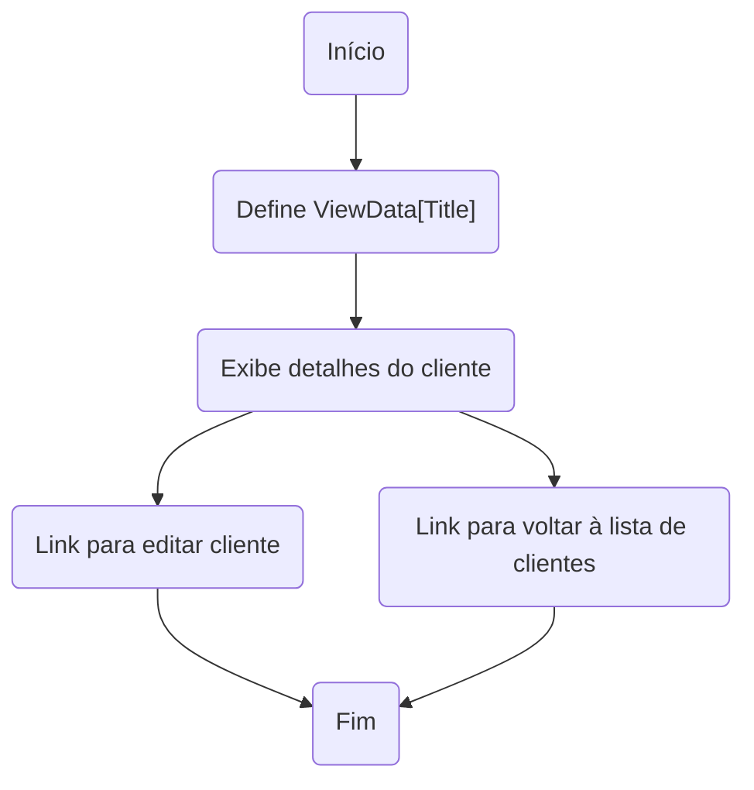
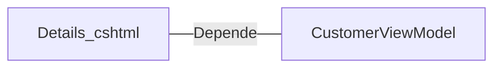

# Details.cshtml: Detalhes do Cliente

## Visão Geral
Este arquivo é uma página de visualização de detalhes do cliente em um aplicativo web ASP.NET MVC. Ele exibe os detalhes de um cliente específico, incluindo o nome, e-mail e data de nascimento. Além disso, fornece links para editar os detalhes do cliente ou voltar para a lista de clientes.

## Fluxo do Processo

## Insights
- O arquivo Details.cshtml é uma View no padrão MVC, responsável por exibir os detalhes de um cliente.
- A View utiliza o modelo `CustomerViewModel` para exibir os dados.
- A View define o título da página através do `ViewData["Title"]`.
- A View exibe os detalhes do cliente, incluindo o nome, e-mail e data de nascimento.
- A View fornece um link para editar os detalhes do cliente e um link para voltar à lista de clientes.

## Dependências (Opcional)
- `CustomerViewModel` : Modelo de dados utilizado para exibir os detalhes do cliente. A View depende deste modelo para exibir os dados corretamente.

## Vulnerabilidades
- Não foram identificadas vulnerabilidades específicas neste código. No entanto, é importante garantir que os dados exibidos nesta página sejam devidamente validados e sanitizados para evitar ataques de injeção de código ou XSS. Além disso, é importante garantir que apenas usuários autorizados possam acessar e editar os detalhes do cliente.