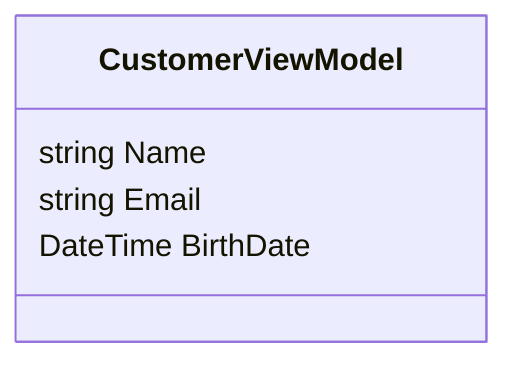
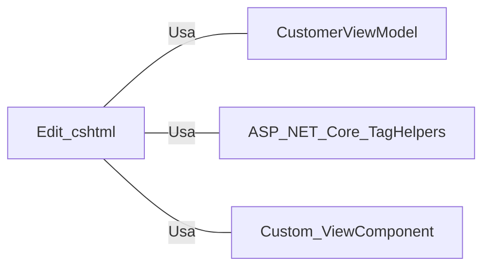

# Edit.cshtml: Edição de Cliente

## Visão Geral
Este arquivo é uma estrutura de dados que representa a página de edição de um cliente em uma aplicação web ASP.NET. Ele contém um formulário que permite ao usuário editar as informações de um cliente existente, incluindo o nome, e-mail e data de nascimento.

## Fluxo do Processo
Como este é uma estrutura de dados, um diagrama de classe é mais apropriado para representar seus atributos.

## Insights
- O formulário contém campos para editar o `Name`, `Email` e `BirthDate` de um `CustomerViewModel`.
- O formulário usa validação para garantir que os dados inseridos sejam válidos. Se os dados não passarem na validação, mensagens de erro serão exibidas ao lado do campo relevante.
- O formulário inclui um botão de envio para salvar as alterações e um link para voltar à lista de clientes.
- O formulário é processado pela ação `Edit` do controlador relevante quando o botão de envio é pressionado.

## Dependências (Opcional)
Este arquivo depende do `CustomerViewModel` para representar os dados do cliente que estão sendo editados. Ele também depende de várias TagHelpers do ASP.NET Core e de um componente de visualização personalizado para exibir mensagens de resumo de validação.

- `CustomerViewModel` : Modelo de dados para um cliente, usado para preencher o formulário e validar os dados de entrada.
- `ASP.NET Core TagHelpers` : Usado para vincular os campos do formulário aos dados do modelo e para exibir mensagens de validação.
- `Custom ViewComponent` : Usado para exibir um resumo de todas as mensagens de validação.

## Vulnerabilidades
Como este é um arquivo de visualização, as vulnerabilidades são geralmente limitadas. No entanto, é importante garantir que a validação adequada esteja em vigor para evitar a injeção de scripts ou ataques de falsificação de solicitação entre sites (CSRF). Neste código, a validação é usada para os campos de entrada, mas não há nenhuma menção explícita à proteção contra CSRF.