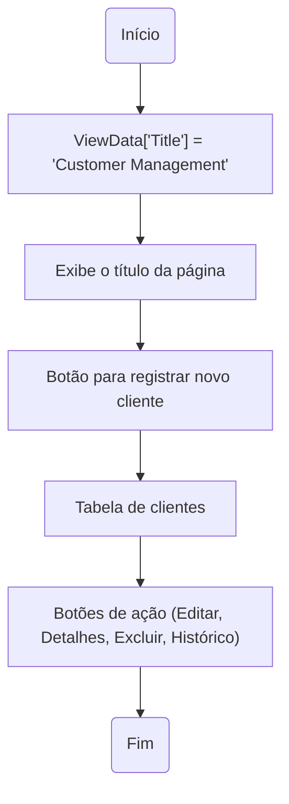
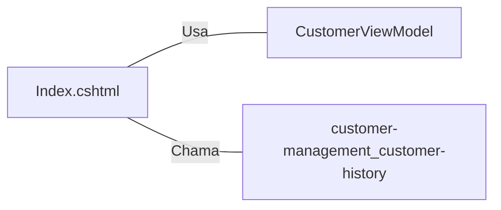

# Index.cshtml: Gerenciamento de Clientes

## Visão Geral
Este código é responsável pela interface de gerenciamento de clientes. Ele permite que os usuários visualizem, criem, editem e excluam registros de clientes. Além disso, ele fornece uma funcionalidade para visualizar o histórico de dados do cliente.

## Fluxo do Processo

## Insights
- O código utiliza o modelo `CustomerViewModel` para exibir os dados do cliente.
- A tabela de clientes exibe o nome, e-mail e data de nascimento do cliente.
- Existem botões de ação para editar, visualizar detalhes, excluir e visualizar o histórico de cada cliente.
- O histórico do cliente é recuperado através de uma chamada AJAX para a URL `https://localhost:44314/customer-management/customer-history/` seguida pelo ID do cliente.

## Dependências (Opcional)

- `CustomerViewModel` : Modelo usado para exibir os dados do cliente na tabela.
- `customer-management_customer-history` : URL chamada para recuperar o histórico do cliente.

## Vulnerabilidades
- O código está fazendo uma chamada AJAX para uma URL fixa, o que pode ser um problema se a URL do serviço mudar no futuro. Uma prática recomendada seria armazenar a URL base em uma variável de configuração.
- O código não verifica se a chamada AJAX foi bem-sucedida ou não. Se a chamada falhar por algum motivo (por exemplo, o serviço está inativo ou a URL está incorreta), o usuário não receberá nenhum feedback.
- O código não escapa os dados retornados pela chamada AJAX antes de inseri-los na tabela de histórico do cliente. Isso pode levar a vulnerabilidades de Cross-Site Scripting (XSS) se os dados do histórico do cliente contiverem scripts maliciosos.