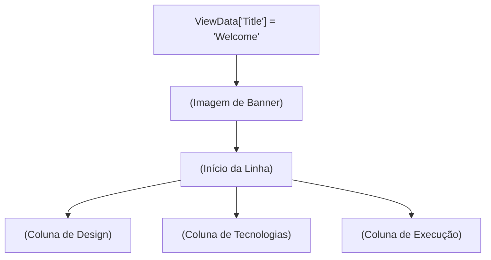

# Index.cshtml: Página Inicial do Projeto

## Visão Geral
Este arquivo é responsável por renderizar a página inicial do projeto. Ele exibe uma imagem de banner, seguida por três colunas de informações. A primeira coluna descreve o design do projeto, a segunda coluna lista as tecnologias utilizadas e a terceira coluna fornece informações sobre como executar o projeto.

## Fluxo do Processo
Como este é um arquivo de estrutura de dados (HTML renderizado por Razor), não há um fluxo de processo específico. No entanto, a estrutura do arquivo pode ser descrita da seguinte forma:

## Insights
- O arquivo utiliza o Razor para renderizar HTML dinamicamente.
- A página inicial é dividida em três colunas principais: Design, Tecnologias e Execução.
- A coluna de Design lista os princípios de design utilizados no projeto.
- A coluna de Tecnologias lista as tecnologias e bibliotecas utilizadas no projeto.
- A coluna de Execução fornece um link para visualizar o projeto online e menciona a capacidade de executar o projeto em qualquer lugar e escalá-lo na nuvem.

## Vulnerabilidades
- O link para visualizar o projeto online está aberto para o público, o que pode ser uma vulnerabilidade se o projeto contiver informações sensíveis.
- A imagem do banner é carregada a partir de um caminho relativo, o que pode ser uma vulnerabilidade se o caminho ou a imagem forem alterados ou excluídos.