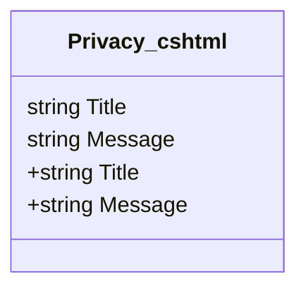

# Privacy.cshtml: Política de Privacidade

## Visão Geral
Este arquivo é responsável por renderizar a página de política de privacidade do site. Ele define o título da página como "Política de Privacidade" e exibe um parágrafo com uma mensagem genérica sobre a política de privacidade do site.

## Fluxo do Processo
Como este é um arquivo de estrutura de dados (HTML renderizado por Razor), não há um fluxo de processo lógico. No entanto, a estrutura do arquivo pode ser representada da seguinte maneira:

## Insights
- O arquivo define o título da página como "Política de Privacidade".
- O arquivo exibe uma mensagem genérica sobre a política de privacidade do site.

## Dependências (Opcional)
Não foram identificadas dependências externas neste arquivo.

## Manipulação de Dados (SQL) (Opcional)
Não há manipulação de dados SQL neste arquivo.