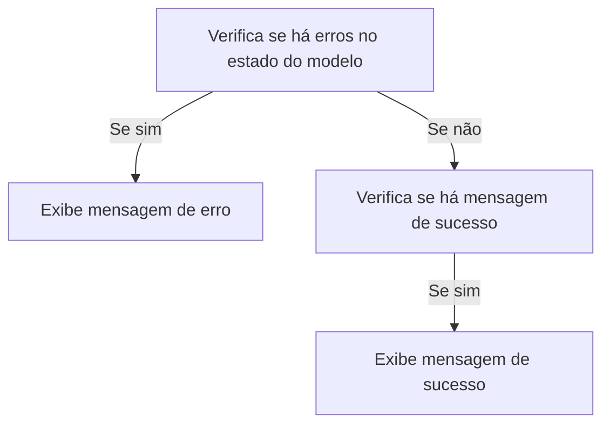

# Default.cshtml: Manipulação de Mensagens de Erro e Sucesso

## Visão Geral
Este código é responsável por manipular e exibir mensagens de erro e sucesso na interface do usuário. Ele verifica se há erros no estado do modelo e exibe uma mensagem de erro se houver. Além disso, verifica se há uma mensagem de sucesso e a exibe se houver.

## Fluxo do Processo

## Insights
- O código verifica o estado do modelo para erros. Se houver erros, uma mensagem de erro é exibida.
- O código também verifica se há uma mensagem de sucesso. Se houver, a mensagem de sucesso é exibida.
- As mensagens são exibidas em um alerta, que pode ser fechado pelo usuário.

## Dependências (Opcional)
Não foram identificadas dependências externas neste código.

## Manipulação de Dados (SQL) (Opcional)
Não há manipulação de dados SQL neste código.

## Vulnerabilidades
- O código não possui validação de entrada para as mensagens exibidas, o que pode levar a ataques de Cross-Site Scripting (XSS) se os dados não forem devidamente sanitizados antes de serem exibidos.
- O código não possui tratamento de exceções, o que pode levar a falhas inesperadas se ocorrerem erros durante a execução.