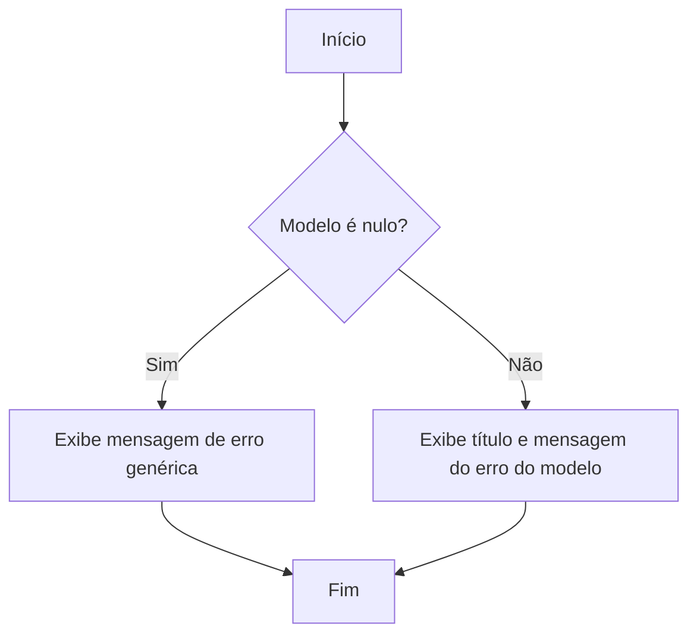

# Error.cshtml: Página de Erro Personalizada

## Visão Geral
Este arquivo `Error.cshtml` é uma página de erro personalizada usada para exibir mensagens de erro para o usuário final. Ele usa o modelo `ErrorViewModel` para exibir o título e a mensagem do erro. Se o modelo for nulo, uma mensagem de erro genérica será exibida.

## Fluxo do Processo

## Insights
- A página de erro personalizada é usada para exibir mensagens de erro para o usuário final.
- O modelo `ErrorViewModel` é usado para exibir o título e a mensagem do erro.
- Se o modelo for nulo, uma mensagem de erro genérica será exibida.

## Dependências (Opcional)
- `ErrorViewModel` : Modelo usado para exibir o título e a mensagem do erro.

## Vulnerabilidades
- O código não verifica se o `Model.Title` ou `Model.Message` são nulos antes de tentar exibi-los, o que pode resultar em uma exceção de referência nula.
- O uso de `Html.Raw` pode levar a vulnerabilidades de Cross-Site Scripting (XSS) se os dados exibidos não forem devidamente sanitizados.