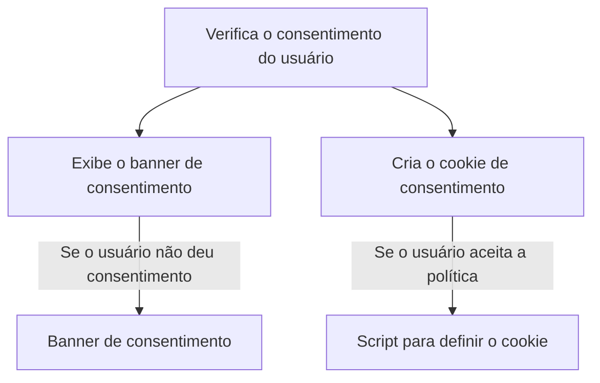
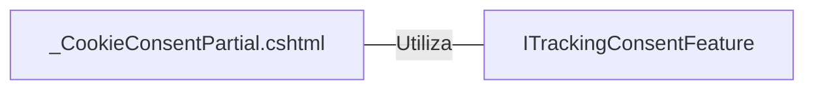

# _CookieConsentPartial.cshtml: Gerenciamento de Consentimento de Cookies

## Visão Geral
Este código é responsável por gerenciar o consentimento de cookies em uma aplicação web. Ele verifica se o usuário já deu consentimento para o rastreamento de cookies. Se o consentimento não foi dado, um banner é exibido para o usuário com uma mensagem sobre a política de privacidade e uso de cookies. O usuário pode aceitar a política clicando no botão "Aceitar".

## Fluxo do Processo

## Insights
- O código utiliza a interface `ITrackingConsentFeature` para verificar se o usuário já deu consentimento para o rastreamento de cookies.
- Se o usuário não deu consentimento, um banner é exibido com uma mensagem sobre a política de privacidade e uso de cookies.
- O usuário pode aceitar a política clicando no botão "Aceitar". Quando o botão é clicado, um cookie de consentimento é criado.

## Dependências (Opcional)
Este código depende da interface `ITrackingConsentFeature` do pacote `Microsoft.AspNetCore.Http.Features` para verificar o consentimento do usuário e criar o cookie de consentimento.

- `ITrackingConsentFeature`: Interface utilizada para verificar o consentimento do usuário e criar o cookie de consentimento.

## Vulnerabilidades
- O código não verifica se o cookie de consentimento foi criado com sucesso. Se houver um erro ao criar o cookie, o usuário pode continuar navegando no site sem dar consentimento para o rastreamento de cookies.
- O código não verifica se o usuário já deu consentimento antes de exibir o banner. Se o usuário já deu consentimento, o banner será exibido novamente.
- O código não verifica se o recurso `ITrackingConsentFeature` está disponível antes de usá-lo. Se o recurso não estiver disponível, o código pode lançar uma exceção.