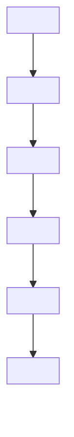
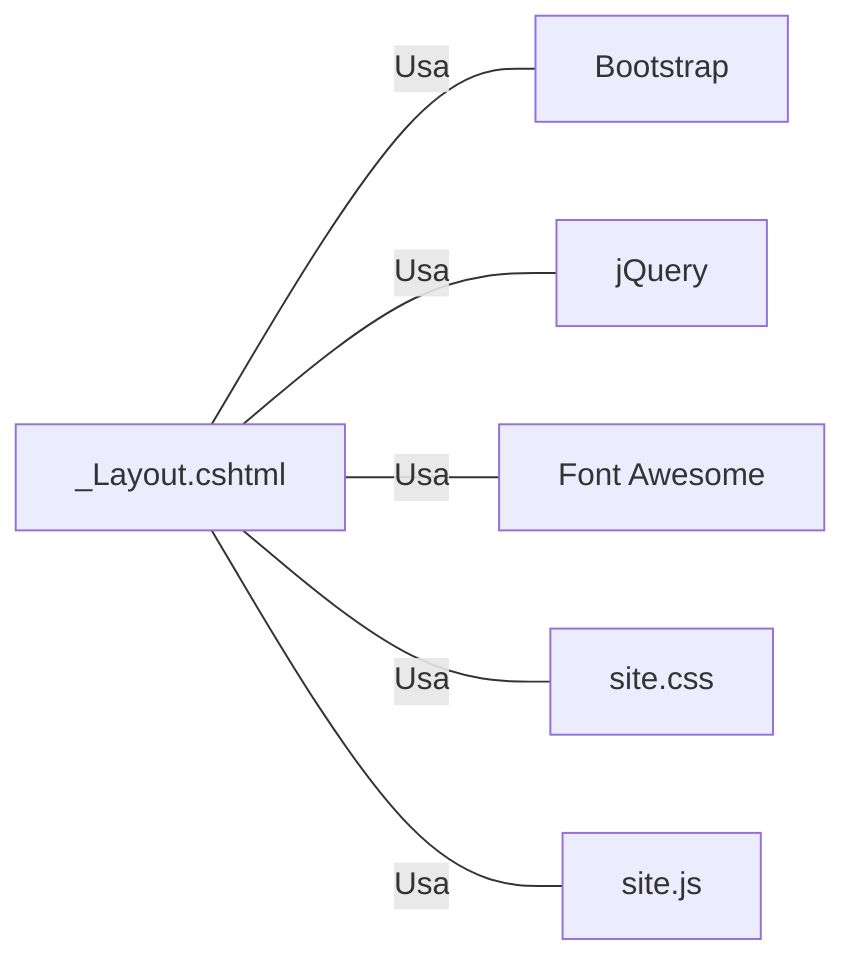

# _Layout.cshtml: Layout Principal do Projeto Equinox

## Visão Geral
Este arquivo define o layout principal do Projeto Equinox. Ele inclui a estrutura básica de uma página HTML, incluindo cabeçalho, corpo e rodapé. O cabeçalho contém a navegação principal, o corpo é onde o conteúdo da página será renderizado e o rodapé contém informações sobre o projeto.

## Fluxo do Processo
Como este é um arquivo de layout, não há um fluxo de processo específico. No entanto, ele define a estrutura básica de todas as páginas que usam este layout. Aqui está um diagrama de como a estrutura é definida:

## Insights
- O layout é responsável por definir a estrutura básica de todas as páginas que usam este layout.
- O layout inclui um cabeçalho com navegação, um corpo onde o conteúdo da página é renderizado e um rodapé com informações sobre o projeto.
- O layout também inclui links para os arquivos CSS e JS necessários.

## Dependências (Opcional)
Este layout depende de vários arquivos CSS e JS externos, incluindo:
- Bootstrap
- jQuery
- Font Awesome
- site.css
- site.js

Aqui está um diagrama de como este layout se relaciona com essas dependências:

## Vulnerabilidades
Como este é um arquivo de layout, não há vulnerabilidades específicas de código a serem destacadas. No entanto, é importante garantir que todos os arquivos CSS e JS externos sejam servidos de fontes confiáveis para evitar possíveis ataques de script entre sites (XSS). Além disso, qualquer conteúdo dinâmico que seja renderizado no layout deve ser devidamente codificado para evitar a injeção de código malicioso.