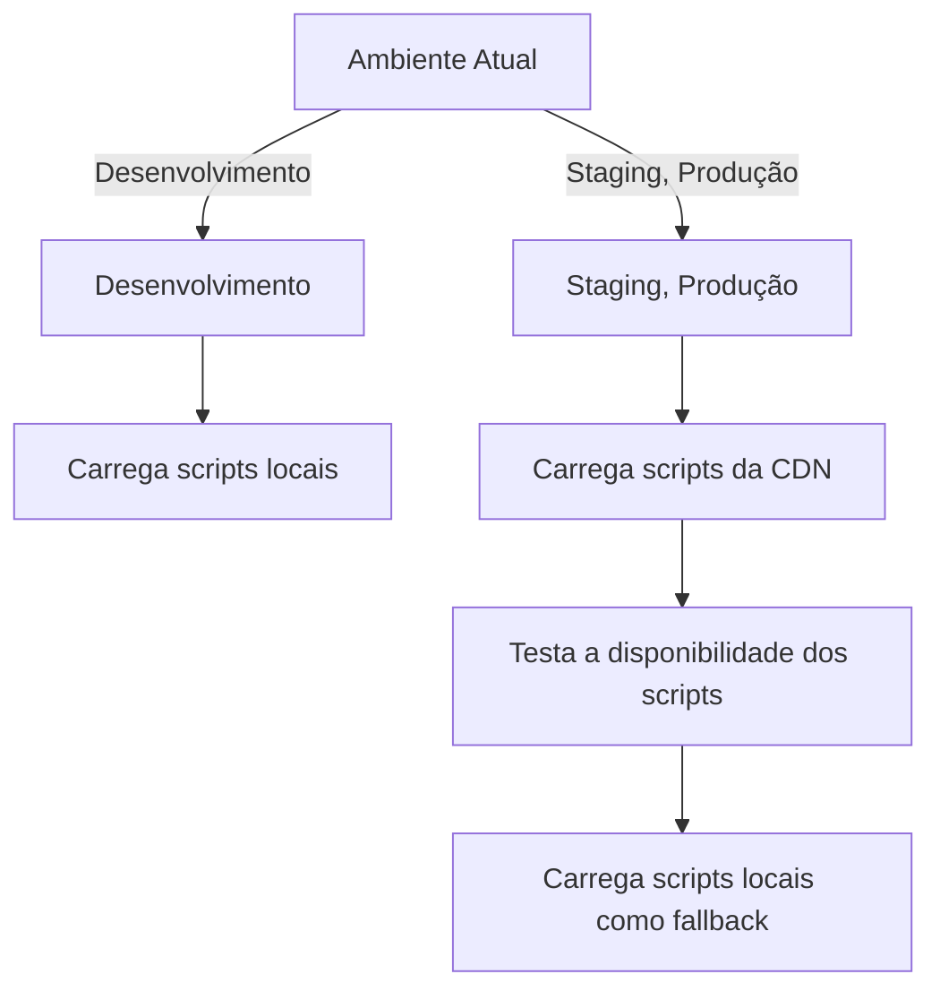
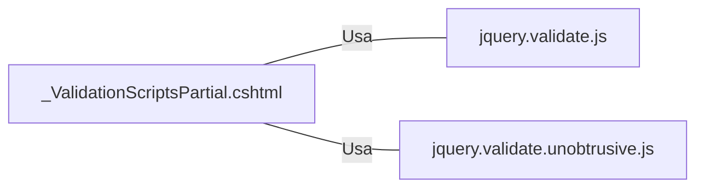

# _ValidationScriptsPartial.cshtml: Scripts de Validação

## Visão Geral
Este arquivo é responsável por carregar os scripts de validação jQuery necessários para a aplicação. Ele verifica o ambiente atual (Desenvolvimento, Staging ou Produção) e carrega os scripts apropriados.

## Fluxo do Processo

## Insights
- O código verifica o ambiente atual e carrega os scripts de validação jQuery apropriados.
- No ambiente de desenvolvimento, os scripts são carregados localmente.
- Nos ambientes de Staging e Produção, os scripts são carregados a partir de uma CDN (Content Delivery Network).
- Se os scripts da CDN não estiverem disponíveis, os scripts locais são carregados como fallback.

## Dependências (Opcional)
Este código depende dos seguintes scripts externos:
- jquery.validate.js
- jquery.validate.unobtrusive.js

- `jquery.validate.js` : Este script é usado para fornecer validação do lado do cliente para formulários.
- `jquery.validate.unobtrusive.js` : Este script adiciona funcionalidades ao script de validação jQuery, permitindo a validação unobtrusive.

## Vulnerabilidades
- O código depende de scripts externos, o que pode representar um risco se a CDN estiver indisponível ou comprometida.
- O código não verifica a integridade dos scripts carregados, o que pode permitir a execução de scripts maliciosos se a CDN for comprometida.