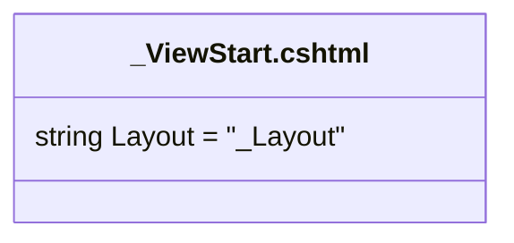

# _ViewStart.cshtml: Configuração do Layout Padrão

## Visão Geral
O arquivo `_ViewStart.cshtml` é utilizado para definir o layout padrão para as views em uma aplicação ASP.NET MVC. Neste caso, o layout padrão é definido como `_Layout`.

## Fluxo do Processo
Como este é um arquivo de configuração e não contém lógica de programação, um diagrama de fluxo de processo não é aplicável. No entanto, a estrutura do arquivo é simples e pode ser representada como abaixo:

## Insights
- O arquivo `_ViewStart.cshtml` é usado para definir o layout padrão para todas as views na aplicação.
- O layout padrão é definido como `_Layout`.

## Vulnerabilidades
Não há vulnerabilidades conhecidas neste código, pois ele apenas define o layout padrão para as views. No entanto, é importante garantir que o arquivo `_Layout` referenciado exista e esteja livre de erros para evitar problemas de renderização das views.